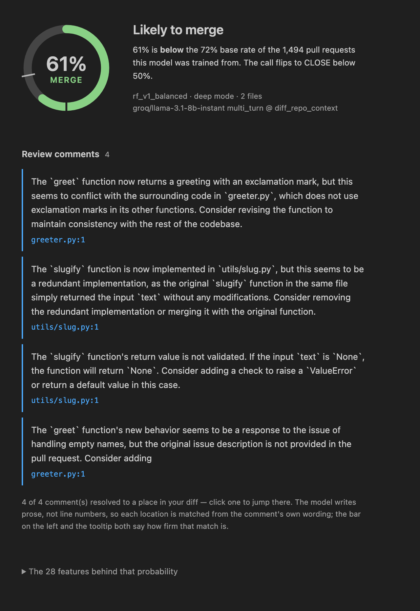
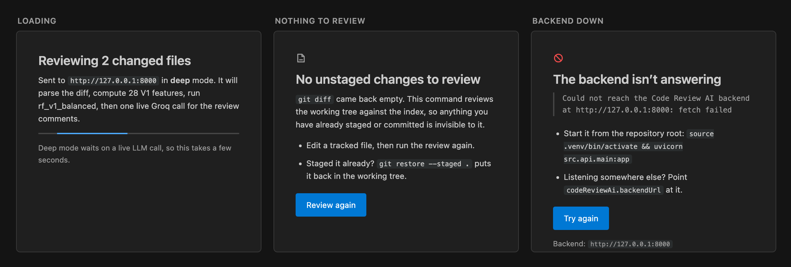
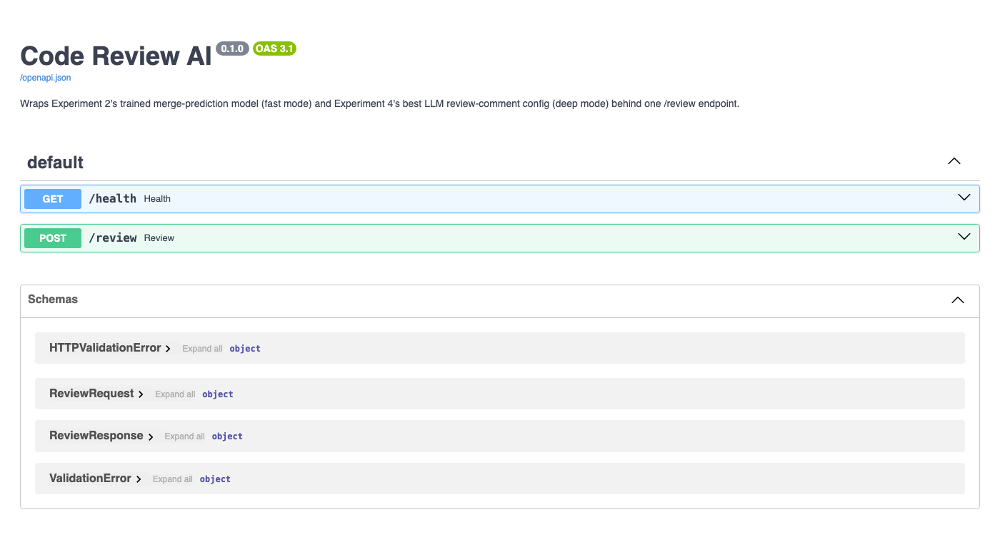
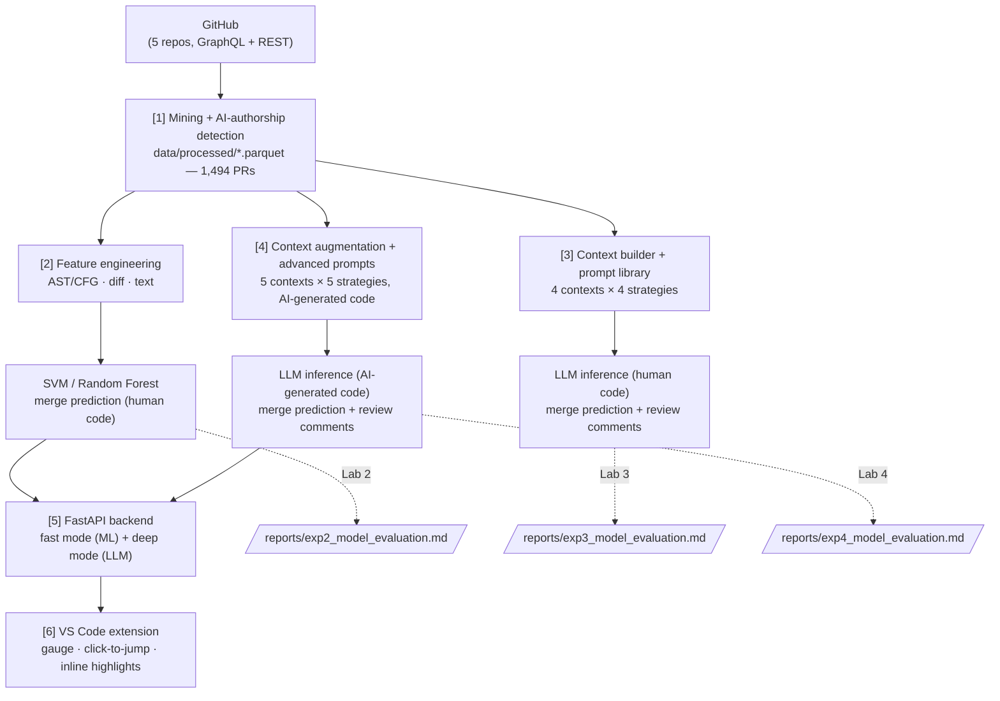

# Code Review AI

[](https://github.com/MarlenMM/code-review-ai/actions/workflows/ci.yml)
[](data/processed)
[](results/tables/exp2_metrics.json)
[](.github/workflows/ci.yml)
[](LICENSE)

An AI-powered code review system built across 4 experiments: a real 1,494-PR
GitHub dataset, trained ML merge-prediction models, an LLM review pipeline
for human-written code, an improved LLM pipeline for AI-generated code, and
a FastAPI backend + VS Code extension that wrap the best of both into one
"Review Current Changes" command.

Built for **Project II — AI-powered Code Review**, HIT Global Summer School
"Intelligence Leading the Frontier, Computing Shaping the Future" (Jul
2026). Every number on this page is pulled from a real run, not estimated —
see [Results](#results) for where each one comes from.

---

## What it does

Open a repo with uncommitted changes, run one command, and get back:

* a **merge probability** (0–100%) from a Random Forest trained on 890 real
  PRs, read against the **72% base rate** of the corpus it learned from —
  so 61% shows up as the below-average change it is, rather than as a
  number that merely sounds healthy, and
* **AI-generated review comments**, each resolved to the file and line it's
  actually about, with click-to-jump navigation and inline highlights.

<p align="center">
  
</p>

*This is the extension's real results panel — real backend, real
`rf_v1_balanced` prediction (0.606), real LLM comments. See
[`reports/vscode_extension_design.md`](reports/vscode_extension_design.md#74-visual-check-of-the-rendered-panel)
for why this is a rendered-HTML screenshot rather than a literal
inside-VS-Code capture, and what was independently verified either way.*

The other three outcomes of the command are designed too, rather than left
as a notification that disappears — a review in flight, a working tree with
nothing in it, and a backend nobody started:

<p align="center">
  
</p>

The rules these are written against — and the failure each one prevents —
are in [`docs/design-constraints.md`](docs/design-constraints.md).

The backend is also self-documenting via FastAPI's generated OpenAPI UI:

<p align="center">
  
</p>

---

## Architecture



Each numbered stage is a self-contained module — the extension only ever
talks to the FastAPI layer, never to the mining/ML code directly, and
Experiment 2's model doesn't care how Experiment 3/4's prompts are worded.

---

## Results

Real numbers, each traceable to a committed artifact.

### Experiment 1 — the dataset

1,494 PRs mined across 5 repos (`microsoft/vscode`, `dotnet/runtime`,
`dotnet/aspnetcore`, `microsoft/semantic-kernel`, `home-assistant/core`):
**380 AI-authored (25.4%)**, 1,114 human-authored. Overall merge rate
**72.0%** (a real, moderate class imbalance — not incidental to Experiment
2's design); AI-authored PRs merge at **65.3%** vs. human-authored at
**74.2%**. → [`results/tables/exp1_summary.json`](results/tables/exp1_summary.json), [`reports/lab1.tex`](reports/lab1.tex) (15pp).

### Experiment 2 — trained ML models (human-written code)

`rf_v1_balanced` (Random Forest, the per-spec V1 feature set,
`class_weight='balanced'`) on a 890-train/224-test time-based split:
**76.8% accuracy, 42.5% not-merged recall** — chosen over the higher-
accuracy `plain` variant specifically *because* of that recall, per the
class-imbalance discussion this experiment itself raises. Feature ablation
found a leaky superset (V0, includes review-process signals) reaches 98%+
ROC-AUC — the concrete evidence for why those features are banned from a
pre-merge prediction. → [`results/tables/exp2_metrics.json`](results/tables/exp2_metrics.json), [`reports/exp2_model_evaluation.md`](reports/exp2_model_evaluation.md), [`reports/lab2.tex`](reports/lab2.tex) (12pp).

### Experiment 3 — LLM review (human-written code)

Full 16-PR / 512-cell grid (4 contexts × 4 prompt strategies × 2 tasks),
Groq `llama-3.1-8b-instant`. Headline: the **best LLM config matches, not
beats**, the best trained model — `diff_commit_message+few_shot` and
`diff_metadata+role_based` both reach **93.75% accuracy / 0.816 macro-F1**,
an *identical* confusion matrix to `rf_v1_plain`. But that's peak,
contingent on the right prompt/context choice — pooled over all 16 configs
(one confusion matrix over all 256 predictions), macro-F1 is **0.525**, well
below the trained model. →
[`results/tables/exp3_metrics.json`](results/tables/exp3_metrics.json), [`reports/exp3_model_evaluation.md`](reports/exp3_model_evaluation.md), [`reports/lab3.tex`](reports/lab3.tex) (16pp).

### Experiment 4 — improving review of AI-generated code

5 contexts × 5 strategies (self-reflection and multi-turn added) targeted
at the AI-authored PR subset. The central finding: on AI-generated code,
the three strategies shared with Experiment 3 (`role_based`/`few_shot`/`cot`)
score **exactly 0.0 not-merged recall on every single context tier** — they
never catch a bad AI PR. Only the two *new* strategies ever do:
`self_reflection` (0.60 recall) and `multi_turn` (0.50 recall, best
macro-F1 at 0.486). Repository-level context is what moves the needle
(not-merged recall 0.0 → 0.4); stacking *everything* regresses back to 0.0
— richer context is not monotonically better. → [`results/tables/exp4_metrics.json`](results/tables/exp4_metrics.json), [`reports/exp4_model_evaluation.md`](reports/exp4_model_evaluation.md), [`reports/lab4.tex`](reports/lab4.tex) (14pp).

*(Experiments 3/4's samples are honestly small — 16 and 3 fully-complete
PRs respectively, both stopped by Groq's real, shared, free-tier daily
quota, not a design choice. Every report says so explicitly rather than
presenting a small sample as more than it is.)*

### The system — backend + extension

`rf_v1_balanced` + Experiment 4's best config (`multi_turn` @
`diff_repo_context`) wrapped behind one `/review` endpoint and a VS Code
command. See [`reports/api_design.md`](reports/api_design.md) and
[`reports/vscode_extension_design.md`](reports/vscode_extension_design.md)
for the two genuine design problems this took: what "deep mode" should
actually spend live LLM quota on, and how to turn the LLM's free-text
review comments into clickable file:line locations without a backend that
returns none.

---

## Repository structure

```
code-review-ai/
├── data/processed/        # the real mined dataset (parquet), committed
├── src/
│   ├── mining/             # GitHub client, AI-authorship detection
│   ├── features/           # AST/CFG builders, feature extraction
│   ├── ml/                 # SVM/RF training, evaluation
│   ├── llm/                 # context builders, prompt library, grid runners, scorers
│   └── api/                  # FastAPI backend (src/api/main.py)
├── vscode-extension/       # the VS Code extension (TypeScript)
├── results/
│   ├── models/              # 12 trained SVM/RF models (.joblib), committed
│   ├── figures/              # generated plots
│   └── tables/                # metrics, summaries (.json/.csv/.jsonl)
├── reports/                # 4 lab reports (.tex + compiled .pdf) + design write-ups
├── tests/                  # 451 pytest tests
├── .github/workflows/      # CI (lint + tests, on every push)
├── docs/                   # design-constraints.md + README screenshots
├── requirements.txt, ruff.toml, .env.example, LICENSE
```

---

## Setup

```bash
git clone <this repo>
cd code-review-ai
python3 -m venv .venv && source .venv/bin/activate
pip install -r requirements.txt
cp .env.example .env   # only needed to re-run mining/LLM steps -- see below
```

The mined dataset (`data/processed/*.parquet`) and the 12 trained models
(`results/models/*.joblib`) are committed, so **the backend and test suite
work immediately** with no API keys and no re-mining:

```bash
pytest tests/ -q                              # 451 tests, fully offline
uvicorn src.api.main:app                      # backend on :8000

# in another shell, from a repo with uncommitted changes:
python3 -c "import json,subprocess; print(json.dumps({'diff': subprocess.run(['git','diff'],capture_output=True,text=True).stdout}))" \
  | curl -s -X POST localhost:8000/review -H 'Content-Type: application/json' -d @-
```

`.env` is only needed to *re-run* mining (`src/mining/`, needs
`GITHUB_TOKEN`), to re-run an LLM grid, or to use the backend's
`mode: "deep"` (needs `DASHSCOPE_API_KEY`). Everything else — the tests, the
fast-mode backend, the extension — works with no keys at all.

**On providers.** Experiments 3 and 4 were measured on Groq
`llama-3.1-8b-instant`, and every committed number in `results/tables/` comes
from that model. Groq has since retired it, so a *live* Groq call now returns
`404 The model ... does not exist`. Two consequences, kept deliberately
separate:

* **Live deep mode uses Qwen** (Alibaba Cloud DashScope, `qwen-plus`) — set
  `DASHSCOPE_API_KEY`. The strategy, context tier and prompts are still
  Experiment 4's; only the model behind them changed, and `/review` labels
  every deep-mode result with the model that actually answered so it is never
  confused with an Experiment 4 measurement.
* **The grids still default to `--provider groq`**, because `data/llm_cache/`
  is keyed on the retired model: a `groq` re-run replays those ~700 recorded
  responses from disk and reproduces Labs 3/4 *exactly*, for free and with no
  key. Re-running under `--provider qwen` is a new experiment, not a
  reproduction of the old one.

See `.env.example` for the region/model settings and
`reports/exp3_grid_run_status.md` for the original provider trail (Gemini and
DeepSeek both evaluated and rejected).

### VS Code extension

```bash
cd vscode-extension
npm install
npm run compile
npm test                       # 66 unit tests, no VS Code/backend needed
npm run package                # produces code-review-ai-0.0.1.vsix
```

Install the packaged extension (`code --install-extension code-review-ai-0.0.1.vsix`,
or the Extensions view's "Install from VSIX..."), or press `F5` inside
`vscode-extension/` for a dev-mode Extension Development Host. Either way,
start the backend first, open a folder with uncommitted git changes, and
run **"Code Review AI: Review Current Changes"** from the Command Palette.
Settings: `codeReviewAi.backendUrl` (default `http://127.0.0.1:8000`),
`codeReviewAi.mode` (`fast`/`deep`). Full details in
[`vscode-extension/README.md`](vscode-extension/README.md).

---

## Testing

| Suite | Count | Command | Needs |
|---|---|---|---|
| Python (mining/ML/LLM/API) | 451 | `pytest tests/ -q` | nothing — fully offline |
| Extension unit | 66 | `cd vscode-extension && npm test` | nothing — no VS Code, no network |
| Extension integration | 7 | `cd vscode-extension && CODE_REVIEW_AI_TEST_WORKSPACE=<dirty repo> npm run test:integration` | a running backend + a real git repo with uncommitted changes; launches a real VS Code instance |

The integration suite is genuine end-to-end verification, not a mock: it
activates the real extension in a real VS Code 1.130.0 instance, sends a
real `git diff` to the real backend, executes the real command, and asserts
the results panel actually opens and click-to-jump actually navigates. See
[`reports/vscode_extension_design.md`](reports/vscode_extension_design.md)
for what it caught (two real bugs) and why it exists instead of GUI
automation (VS Code is only grantable at click-only access to computer-use
tooling in this environment — no typing, so the Command Palette isn't
reachable that way).

CI (`.github/workflows/ci.yml`) runs the Python and extension-unit suites
plus lint on every push — not the integration suite, which needs a live
backend and downloads a ~300MB VS Code build (documented in the workflow
file itself). Lint is intentionally scoped to Pyflakes + syntax errors
(`ruff.toml`), not Ruff's full style rule set — see that file for why.

---

## Reports

| | |
|---|---|
| [`reports/lab1.tex`](reports/lab1.tex) / [`.pdf`](reports/lab1.pdf) | Experiment 1: dataset, mining, AI-authorship detection (15pp) |
| [`reports/lab2.tex`](reports/lab2.tex) / [`.pdf`](reports/lab2.pdf) | Experiment 2: features, SVM/RF, evaluation (12pp) |
| [`reports/lab3.tex`](reports/lab3.tex) / [`.pdf`](reports/lab3.pdf) | Experiment 3: LLM review, human-written code (16pp) |
| [`reports/lab4.tex`](reports/lab4.tex) / [`.pdf`](reports/lab4.pdf) | Experiment 4: LLM review, AI-generated code (14pp) |
| [`reports/final_report.md`](reports/final_report.md) / [`.pdf`](reports/final_report.pdf) | **Final consolidated report** — the throughline across all 4 experiments + the system (13pp) |
| [`reports/slides.pptx`](reports/slides.pptx) / [`slides_design.md`](reports/slides_design.md) | Presentation deck (10 slides) + how it was built and verified |
| [`reports/verification_signoff.md`](reports/verification_signoff.md) | **Cross-report verification pass** — every quoted number re-checked against `results/tables/*.json` and the parquet data |
| [`reports/qa_prep.md`](reports/qa_prep.md) | Defence prep: talking points for all 20 reflection questions + Lecture 1's discussion questions |
| [`reports/api_design.md`](reports/api_design.md) | Backend design: model choice, fast/deep mode, quota strategy |
| [`reports/vscode_extension_design.md`](reports/vscode_extension_design.md) | Extension design: core scaffold, gauge/click-to-jump/highlights, panel states, verification |
| [`docs/design-constraints.md`](docs/design-constraints.md) | The 10 rules the review panel is written against, and the failure each one prevents |
| [`reports/exp2_model_evaluation.md`](reports/exp2_model_evaluation.md), [`exp3_model_evaluation.md`](reports/exp3_model_evaluation.md), [`exp4_model_evaluation.md`](reports/exp4_model_evaluation.md) | Per-experiment result analysis behind each lab report |

Every lab report compiles cleanly with `xelatex` (see
`reports/template/` and the `ctexart.cls` shim documented inside `lab1.tex`'s
own header if you need to rebuild a PDF).

---

## License

[MIT](LICENSE).
